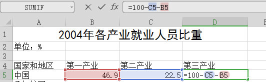
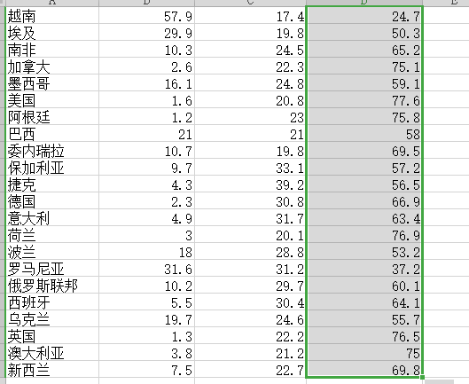
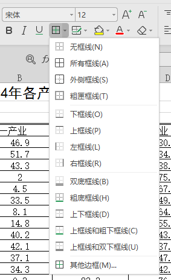
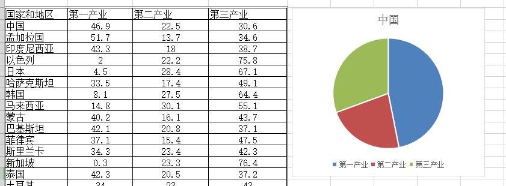
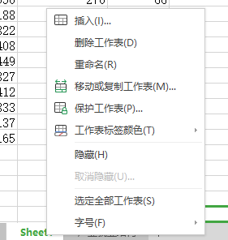

+ 第1题
	+ 选中"产业结构数据.htm" 右键-打开方式-浏览器打开
	+ 将网页中数据选中，复制（ctrl+c），打开ex.xslx，鼠标点击A25单元格（A列25行），将光标移至此处，粘贴（ctrl+v)。 
+ 第2题
	+ 输入题目要求内容。
	+ 在开始选项卡-字体 设置“黑体，18号，加粗”。  
		
	+ 选中1行A-D列，点击“合并居中”。     
+ 第3题
	+ 在D4单元格中输入“第三产业”。
	+ 在D5单元格中输入公式“=100-C5-B5”，输完按回车键确定。（C5：C5单元格，内容为第二产业比重；B5：B5单元格，内容为第一产业比重。)   
	+ 选中D5单元格，将鼠标移至单元格右下角，待鼠标变成黑色十字时，点击鼠标左键拖至41行后松开鼠标。此时，自动填充每行数据。   
+ 第4题
	+ 选中B5至D41单元格（数字数据部分），点击开始选项卡中的水平居中。     
+ 第5题
	+ 选中A4-D41单元格，开始选项卡-边框-其他边框，对框线进行设置。     
	+ 选中双线，选择外边框（上下左右边框）；选中单线，选择内边框。     
+ 第6题
	+ 选中A4-D5单元格，切换到插入选项卡，在插入图表中选择饼图即可。     
+ 第7题
	+ 选择sheet1工作表(窗口左下角切换)，点击表名，右键-重命名，输入“就业”。     
+ 第8题
	+ 切换到“工资”工作表，选择表中有数据的任意单元格，选择数据选项卡-自动筛选。在表头右下角下拉框中，选择数字筛选-大于，在对话框中输入50000，单击回车。
+ 第9题
	+ 文件选项卡-保存（ctrl+s）。
